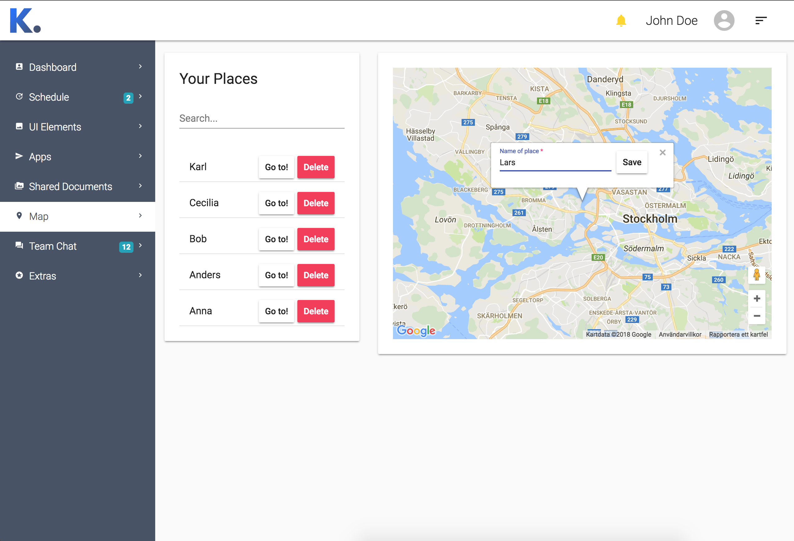

# Kumpan Map Assignment

An Single Page Application made with Angular to save places in a list by interacting with Google Map API



## Getting Started

These instructions will get you a copy of the project up and running on your local machine for development and testing purposes. See deployment for notes on how to deploy the project on a live system.

### Prerequisites

#### NOTE
The below setup instructions assume you have added local npm bin folders to your path. If this is not the case you will need to install the Angular CLI globally.

#### Installing

These are the steps for installing the application onto your system.

```
# clone the repo
git clone https://github.com/rojanDinc/Kumpan_map.git

# change directory to repo
cd kumpan-map-angular

# Use npm or yarn to install the dependencies:
npm install

# OR
yarn

# start the server
ng serve
```
Navigate to http://localhost:4200/ in your browser

## Built With

- [SebastianM/angular-google-maps](https://github.com/SebastianM/angular-google-maps) - Angular 2+ Google Maps Components
- [ngrx/store](https://github.com/ngrx/store) - RxJS powered state management for Angular apps, inspired by Redux
- [ngrx/store-devtools](https://github.com/ngrx/store-devtools) - Instrumentation for @ngrx/store enabling time-travel debugging
- [angular/material2](https://github.com/angular/material2) - Material Design components for Angular
- [twbs/bootstrap](https://github.com/twbs/bootstrap) - The most popular HTML, CSS, and JavaScript framework for developing responsive, mobile first projects on the web.

## Thoughts 
The creation of this project was neither too hard or easy. There are plenty of documentation of the different libraries used.
First decision was to either use ReactJs or Angular, I went with Angular for its TypeScript language.
There are different libraries to choose from when you need a specific type of plugin and to narrow down my choice I always start with reading about the libraries and get a better understanding of which one to choose for my work.
I've learned from working with this project and feel free to test it and share your thoughts.

## Authors

* **Rojan Dinc**

## License

This project is licensed under the MIT License - see the [LICENSE.md](LICENSE.md) file for details

## Acknowledgments

* Thanks to kumpan for giving me this opportunity
